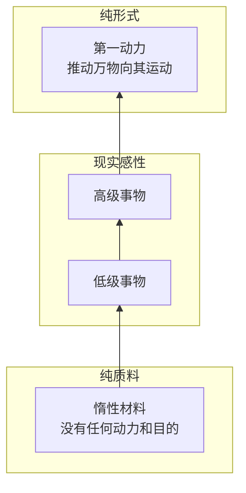
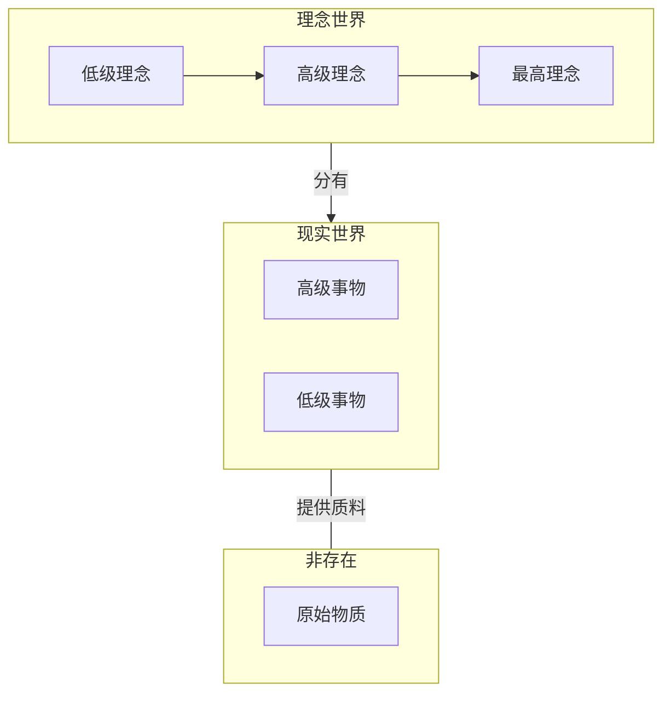

# 亚里士多德哲学

## 主要内容
引言
对柏拉图的批判
存在是什么
存在即实体
实体哲学

## 正文
### 引言
哲学史上至少有两位哲学家站在两种截然对立学说的十字路口，将两派观点综合起来，融于自身创立新的学说，完成一次彻底的哲学革命。

后一位是近代的康德，面对[怀疑论]()（经验论发展到极端）和[独断论]()（唯理论发展到极端）的冲突，康德提出了一个划时代的问题：“先天综合判断如何成为可能？”，打开了近代德国古典哲学的大门。综合两种对立的学说必然意味着妥协，妥协的代价是自身陷入新的矛盾，而康德哲学的矛盾成为许多现代哲学思想的来源。

前一位是古希腊的亚里士多德，面对德谟克利特的原子论和柏拉图的理念论的冲突，亚里士多德发现两种学说实质上有异曲同工之妙。德谟克利特的原子论强调原子物质与感性现实的对立，认为原子构成了现实世界的基础。柏拉图理念论强调理念世界与感性现实的对立，认为理念才是真实而完美的存在。看似最微小实在的物质性原子和最宏大抽象的精神性理念是不可调和，其实两者都在强调现实感性背后有一个实在的事物，主张感性现实都是由某种实在的事物构成的。然而不论原子还是理念都是抽象思维的产物，两种学说都认为这种源于思维的实在本源是先于感性世界存在，并且比感性世界更加真实。原子论向下寻找，理念论向上溯源，他们都只不过是碎片化的巴门尼德的存在，它们的冲突本质上一种**窝里斗**。

@import "./image/窝里斗.jpeg"

亚里士多德发现两种学说之间的相似性后，综合前人思想创立了自己的实体哲学。然而同康德一样，综合就意味着妥协，亚里士多德师承柏拉图，因而他的实体哲学偏向理念论，在妥协中产生的矛盾也成为日后经院哲学争论不休的焦点问题。

### 对柏拉图的批判
“吾爱吾师，吾更爱真理”。亚里士多德对其师柏拉图有崇敬，但依然对柏拉图理念论进行了全面的批判。
1. 理念无法独立存在。亚里士多德从经验的角度出发，感性事物的理念形式只能存在与具体事物之中。
2. 理念存在性论证缺乏可靠性。如果理念比感性事物更完美，那消极的感性事物是比理念更消极还是积极？如果桌子的理念相比于现实的桌子更完美，两者建立联系需要一个不完美桌子的理念，而如果不完美桌子的理念存在，则需要存在一个更加不完美的现实的桌子，这样会陷入逻辑上无限的倒退。
@import "./image/忍术分身.gif"
3. “分有”和“模仿”只是诗意非严谨地表达。现实事物究竟如何分有模仿理念？不论永恒的苏格拉底理念是否存在，苏格拉底的生老病死依然会发生。一个不变的理念如何将形式分给一个变化的现实事物？苏格拉底既是人，又是动物，那他既模仿了人这个理念，又模仿了动物这个理念，又模仿了苏格拉底这个理念，这岂不是很矛盾？
4. 理念对认识现实毫无意义。理念无法解释现实事物的运动毫无帮助，反而创造了等量的理念事物，这样我们不仅要思考现实世界，还要思考理念世界，将现实问题弄巧成拙。

基于以上四点，亚里士多德总结：哲学家研究现实事物的原因，提出了各式各样的实在性事物，扬言他们是现实事物的本源，然而实际上只是用另一种新的事物代替了现实事物，完全无法解释清楚现实事物变化运动的原因。

### 存在究竟是什么
思考清楚前人学说的缺点后，亚里士多德问出了一个石破天惊的问题：“存在究竟是什么？”。先前的所有关于存在的哲学，赫拉克利特的“逻各斯”、毕达哥拉斯的“数是万物之源”、巴门尼德的“存在者存在，非存在者不存在”、柏拉图的“理念”、乃至德谟克利特的“原子在虚空运动”，他们都只说了什么是存在，而没有指出存在究竟是什么。正如指出三角形、圆、矩形是图形，并不能说明图形是什么。

从前的一切存在哲学都在争论存在的性质，例如巴门尼德指出存在独一无二，而理念、原子表达存在其实是多。理念论认为存在是思维，而原子论认为存在是物质。这种无止境的争论却忽视了一个前提，**存在究竟是什么**？既然如此，亚里士多德认为在讨论存在之前，需要给存在下一个定义。

那么如何给一个事物下定义呢？以人为例，人是属于动物种类，而牛、马也属于动物，人与其他动物的差别在于有理性，因此种加属差就可以给人下一个定义，人是有理性的动物。这个定义中，动物是种，有理性是属差。然而种加属差给存在下定义却失效了，因为存在是最大的概念。人属于动物，动物属于生物，生物属于物质，物质属于存在，而存在却不属于任何事物。既然无法向上溯源，只能向下兼容，分析存在的内涵。

亚里士多德认为大体有两类存在：
+ 偶然性属性，比如这个人是白的，但是由于这个人可能晒黑，因此白这种存在就是偶然的。
+ 必然性本质，即范畴，对事物进行高度概括和抽象形成的基本概念，分为实体、数量、性质、关系、地点、时间、姿态、状态、动作和遭受。

上述范畴是任何一个事物必然的存在，去掉了任意一个范畴这个东西也就不存在。而实体是范畴中最重要的，其他范畴都承载在一个实体之上。实体代表一个事物是什么，其他范畴代表一个事物怎么样，而怎么样需要建立在是什么的基础上才有意义。例如，我们只能说一个人在运动，人承载了“一”这个数量范畴和“运动”这个状态范畴，我们不能单说“一”或“运动”，这是毫无意义的。这样一来，**存在究竟是什么**被归结为**实体究竟是什么**，因而亚里士多德[第一哲学]()也被称为实体哲学。

### 实体是什么
实体哲学旨在回答一下三个问题：
1. 实体是什么？狭义的实体学说，即对实体的定义。
2. 实体的原因是什么？例如，房屋由砖瓦构成（质料），做成图纸上的形式（形式），工匠堆砌而成（动力），供人们居住（目的）。这四个方面形成了实体四因说。
3. 实体是如何形成的？例如，人由骨骼、肌肉、神经组成（第二个问题），但所有脊椎动物都有这些组织，但为何人却有特殊的能动性？这个问题研究实体从原因到实体本身的发展过程。

#### 实体的定义
亚里士多德将存在的问题归结为实体的问题，而实体的问题中最根本的是实体的定义。他给实体的定义为：“**实体既不述说一个主体，又不依存于一个主体**”。即个别的人，个别的物，个别的想法等。
+ 不述说一个主体：
一句话需要有主语、谓语、宾语。不述说一个主体表示实体只能在句子中做主语，而只能做主语的只能是个别的事物。例如，苏格拉底是白的✅，白的是苏格拉底❌，苏格拉底是人✅，人是苏格拉底❌。白的是属性概念，人是种属概念，而这两者可以描述一个主体，但苏格拉底是一个个别的事物，因而他无法述说一个主体。
+ 不依存于一个主体:
上一节提到了除实体外其他范畴，它们都需要依存于实体，无法独立存在，“白的”、“一”、“运动”这些范畴都需要依存于一个事物才有意义，因此实体是独立实在的。

因此，实体是独立实在的个别事物。从定义出发，亚里士多德有强调了实体的性质：
1. 实体是具体个别的事物。
2. 实体没有与之相反的事物。例如，与大相反的是小，但非苏格拉底是什么事物呢？
3. 实体没有程度上的差别。基于第二条，既然不存在相反的事物，谈论程度是毫无意义的。例如，亚里士多德比柏拉图更苏格拉底？？？
4. 实体是变中之不变。苏格拉底不论生老病死，不论上溯千年或者下启千年都是那个希腊哲学家。从其貌不扬的路人，到热衷辩论的哲学家，到刑场上淡然的囚犯，到千年伟大的思想家，他所承载的属性不断变化，唯有苏格拉底这个实体亘古不变。

从实体的定义和性质我们可以看出，亚里士多德的实体与柏拉图的理念恰好是背道而驰的。柏拉图从思维出发，强调抽象的理念是真正的存在，现实事物需要分有完美的理念才得以存在。而亚里士多德从经验事实出发，强调具体个别的事物是真正的存在，抽象的理念需要依附其中才得以存在。因此，两者矛盾根源在于现实感性与理念存在的先后顺序。亚里士多德认为现实先于理念，因而理念寓于现实感性。

然而，毕竟师出柏拉图，亚里士多德实体哲学依然向理念论妥协。亚里士多德认为个别事物只是第一实体，而还有第二实体，即种属概念。例如，人虽然可以用来述说苏格拉底，但人可以被更大的种属概念动物来述说，并且人也可以是不依存于事物独立存在的。

在种属概念上的妥协，承认有两种实体导致实体哲学不可调和的矛盾。从经验现实中，我们归纳出理性、有四只、直立行走等特点组合起来的一个抽象人是实际存在的，而不仅仅只是我们的抽象思维或代称，本质上就是承认理念论中所有的理念都是第二实体。亚里士多德在感性现实和抽象理念寻求妥协又部分地回到了柏拉图立场，而现实和理念的真实性问题在中世纪经院哲学达到顶峰，这一争论被成为[共相之争](https://zh.wikipedia.org/wiki/共相)。

我国先秦战国名家代表人物公孙龙，提出[白马非马](https://zh.wikipedia.org/wiki/白马非马)和[离坚白](https://zh.wikipedia.org/wiki/离坚白)等论点就是对共相问题的讨论。然而我国古代重实际轻思辨，因而该论题未能得到进一步发展为逻辑学。封建王朝集权统治，对思想控制极其严格，禁止私学。例如，[墨家](https://zh.wikipedia.org/wiki/墨家)强调兼爱非攻，期望打破宗法制度，注重实际效益，善于发明工具，形成了逻辑学、几何学和力学的萌芽。然而这些理论都不利于统治，因而受到极力打压。自汉朝罢黜百家，独尊儒术后，儒家学说形成思想垄断，其余学说都日渐式微。
@import "./image/白马非马.jpeg"

#### 实体的原因
当清楚实体的定义后就要分析实体的原因是什么，亚里士多德根据希腊哲学的各种观点，将实体的原因总结为四个方面的因素，即质料因、形式因、动力因和目的因，形成了他的四因说：
1. 质料因。实体由什么材料做成。
2. 形式因。实体被规定为什么形式。
3. 动力因。实体被什么东西做成现在的样子。
4. 目的因。实体为什么会形成。

对于人造物，这四点可以明确规定，但对于自然物主要归结为质料和形式，而动力与目的则归结于形式之中，形式是质料追求的目的和动力。例如，一颗种子长成一棵树，种子是质料，树是形式，而树既是种子生长的动力又是目的。因而，万事万物的运动变化都是追求质料与形式的统一，有低级向高级不断转化的过程。泥土是砖头的质料，砖头是泥土的形式，而砖头是房屋的质料，房屋是砖头的形式。低级事物是高级事物的质料，高级事物是低级事物的形式，同时也是低级事物运动发展的目的与动力。而最低级的事物则是纯质料，即德谟克利特的原子，最高级的事物是纯形式，即柏拉图理念。实体则是理念加到原子而形成的各种感性事物。

亚里士多德实体哲学世界模型如下：

柏拉图理念论世界模型如下：

对比两人这形而上学结构，亚里士多德将感性事物进行层次区分，根据形式与质料的关系将其整理为一个由低级向高级运动的过程。柏拉图则在理念世界进行层次区分，将低级向高级运动的过程赋予理念，而不同等级的感性事物源于不同等级的理念。可以说亚里士多德仅仅将理念世界的抽象思维由低级向高级的运动过程转化为现实世界的感性物质运动过程。然而其思想内核依然是理念论，他和柏拉图都认为现实感性的源动力在于纯形式的理念，而原始物质是没有任何动力，仅仅在形式的吸引指导下，由低级实体向高级实体运动，最终的目标是趋向于一种纯观念的最高实体，柏拉图称其为善，亚里士多德称其为第一推动力，然而它们都是自身不动的，却吸引这感性事物向其运动。

亚里士多德所谓的独立个别的实体，先于理念存在，然而就是这样独立个别脱离理念存在的实体自身动力却依然源于纯理念的实体，因此实体依然没有脱离理念存在。例如，亚里士多德以铜像为例，他认为铜只是缺乏形式的纯粹质料，虽然具有能被塑造成任何雕塑的可能性，但在实现之前他什么也不是。虽然质料和形式都是实体，但形式作为个别性的东西比普遍的质料更具有实体性，这与他所说的实体没有程度上的差别是截然相反的。在虚空中运动从而生成万物的原子被剥脱了运动的性质，仅仅作为僵死的惰性质料服务于形式。因此，第一实体具有个别独立性，但构成第一实体的质料与形式中，他将形式看做更高级的，导向了柏拉图的理念论。

#### 实体的生成
基于质料到形式的运动过程，亚里士多德很自然地从“潜能到现实”的角度解释实体生成的原因。潜能与现实并非两个漠不相关的事物，而是一个事物的两种状态，与质料与形式向对应。任何事物的质料都是一种潜能，将形式赋予质料则完成了潜能现实化的过程，而现实的事物又作为一种新的潜能向更高等级的现实运动，整个世界的原因就是不同等级的潜能向现实转化的过程。最低端是绝对潜能，对应纯质料，最高端是绝对现实，对应纯形式。绝对现实不再向更高级发展，也就成为第一推动力。因而，一个事物的产生、运动和变化不再是由外在动力推动，而是内在潜能自我生长为现实，并追求绝对现实的过程。例如，一颗种子生长为大树的原因是因为种子种包含了成为了大树的潜能，大树就是种子生成和生长的原因。

亚里士多德实体的原因是一种有机论，认为事物动力来自内在。与之相对，机械论认为事物动力来自外部的力量。前者容易引出神学，后者容易引出科学。然而近代机械运动依然无法解释事物运动的规则从何而来，因而最终也会求助于神学。

## 总结
在亚里士多德之前，德谟克利特的原子论和柏拉图的理念论完成了古代自然哲学和形而上学的总结。亚里士多德将两种针锋相对的理念综合在一起，百川归海，呈现了一种更宽泛的实在论，将原子和理念都看做实体，虽然他更加偏向理念论认为理念相比于原子更加实在。他的思想也作为蓄水池，中世纪经院哲学的共相之争，近代的唯物唯心之争都源于对他思想中的矛盾与妥协。

